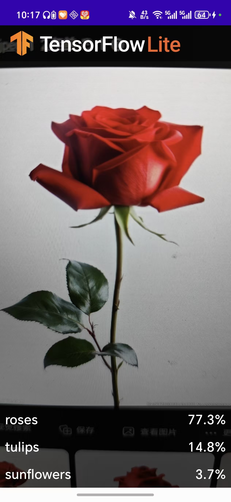
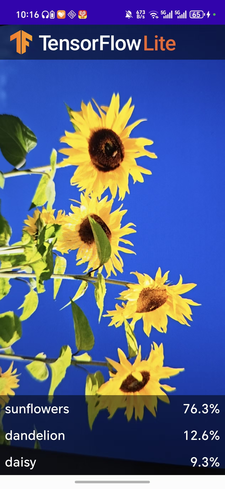

# TFL Classify - 智能图像分类APP实验报告

## 一、实验目标

本实验旨在构建一个基于 **TensorFlow Lite** 的 Android 花卉识别应用，实现实时图像分类功能。通过完成该实验，掌握以下核心能力：

- 在 Android 端部署轻量级深度学习模型（TensorFlow Lite）
- 使用 CameraX 相机库进行实时图像采集与分析
- 运用 Android Architecture Components（ViewModel、LiveData）进行数据管理
- 熟练使用 Kotlin 语言进行 Android 开发
- 掌握 GPU 加速推理的配置与兼容性处理

---

## 二、主要技术点

| 技术 | 说明 |
|------|------|
| **TensorFlow Lite** | Google 推出的轻量级深度学习推理框架，专为移动端和嵌入式设备设计，可高效运行预训练模型 |
| **CameraX** | Android Jetpack 官方相机库，抽象了相机硬件差异，提供生命周期感知的相机操作接口 |
| **ViewModel & LiveData** | Android Architecture 组件，分别用于管理 UI 数据和实现可观察的数据绑定 |
| **RenderScript** | Android 高性能计算框架，用于高效完成 YUV 到 RGB 的图像格式转换 |
| **RecyclerView + DataBinding** | 用于高效展示识别结果列表，通过 DataBinding 自动绑定数据到 UI |
| **Kotlin** | 项目主要开发语言，利用其简洁语法和空安全特性 |

---

## 三、项目结构分析

### 3.1 整体结构

项目采用多模块结构，包含 `start`（起始模板）和 `finish`（完整实现）两个模块：

```
TFLClassify-main/
├── start/              # 起始模块（待完成的 TODO 模板）
├── finish/             # 完成模块（完整的参考实现）
├── build.gradle        # 根级构建配置
├── settings.gradle     # 项目设置
└── pic/                # 测试图片（rose.jpg, sunflower.jpg）
```

### 3.2 核心源码结构（以 finish 模块为例）

```
finish/src/main/java/org/tensorflow/lite/examples/classification/
├── MainActivity.kt              # 主入口：CameraX 初始化、权限处理、UI 绑定
├── viewmodel/
│   └── RecognitionViewModel.kt  # ViewModel + Recognition 数据类
├── util/
│   └── YuvToRgbConverter.kt     # YUV420_888 → Bitmap 格式转换工具
└── ui/
    └── RecognitionAdapter.kt    # RecyclerView 适配器（ListAdapter + DiffUtil）

finish/src/main/res/layout/
├── activity_main.xml            # 主布局：相机预览 + 工具栏 + 结果列表
└── recognition_item.xml         # 识别结果项布局（标签 + 置信度）

finish/src/main/ml/
└── FlowerModel.tflite           # TensorFlow Lite 花卉分类模型
```

---

## 四、关键代码实现分析

### 4.1 相机初始化与权限管理

在 `MainActivity` 中，通过 CameraX 实现相机预览和图像帧分析：

```kotlin
// CameraX 初始化（startCamera方法）
val cameraProviderFuture = ProcessCameraProvider.getInstance(this)
cameraProviderFuture.addListener(Runnable {
    val cameraProvider: ProcessCameraProvider = cameraProviderFuture.get()

    // 1. 预览用例 - 将相机画面显示到 PreviewView
    preview = Preview.Builder().build()

    // 2. 图像分析用例 - 将每一帧送入 ML 模型
    imageAnalyzer = ImageAnalysis.Builder()
        .setTargetResolution(Size(224, 224))  // 224x224 符合模型输入要求
        .setBackpressureStrategy(ImageAnalysis.STRATEGY_KEEP_ONLY_LATEST) // 丢弃旧帧
        .build()
        .also { analysisUseCase ->
            analysisUseCase.setAnalyzer(cameraExecutor, ImageAnalyzer(this) { items ->
                recogViewModel.updateData(items) // LiveData 更新识别结果
            })
        }

    // 3. 绑定到生命周期
    camera = cameraProvider.bindToLifecycle(this, cameraSelector, preview, imageAnalyzer)
    preview.setSurfaceProvider(viewFinder.surfaceProvider)
}, ContextCompat.getMainExecutor(this))
```

权限管理使用 `ActivityCompat.requestPermissions` 动态请求相机权限，并在 `onRequestPermissionsResult` 中处理授权结果。

### 4.2 TensorFlow Lite 模型加载（TODO 1 & TODO 6）

在 `ImageAnalyzer` 内部类中，使用懒加载模式初始化 TensorFlow Lite 模型，并支持 GPU 加速：

```kotlin
private val flowerModel: FlowerModel by lazy {
    val compatList = CompatibilityList()

    // 检查当前设备是否支持 GPU 委派
    val options = if (compatList.isDelegateSupportedOnThisDevice) {
        Log.d(TAG, "This device is GPU Compatible")
        Model.Options.Builder().setDevice(Model.Device.GPU).build()
    } else {
        Log.d(TAG, "This device is GPU Incompatible")
        Model.Options.Builder().setNumThreads(4).build()  // 回退到 CPU 多线程
    }

    FlowerModel.newInstance(ctx, options)
}
```

此处使用了 TensorFlow Lite 的 GPU 委派功能，在支持 GPU 的设备上可获得更快的推理速度；不支持的设备自动回退到 CPU 多线程模式（4线程）。

### 4.3 图像处理与模型推理（TODO 2、TODO 3、TODO 4）

`ImageAnalyzer.analyze()` 是核心处理方法，包含完整的图像预处理→模型推理→结果筛选流程：

```kotlin
override fun analyze(imageProxy: ImageProxy) {
    val items = mutableListOf<Recognition>()

    // TODO 2: 将 Camera 图像（YUV_420_888）转换为 Bitmap，再转为 TensorImage
    val tfImage = TensorImage.fromBitmap(toBitmap(imageProxy))

    // TODO 3: 运行模型推理，对结果按置信度排序，筛选出 Top-3
    val outputs = flowerModel.process(tfImage)
        .probabilityAsCategoryList.apply {
            sortByDescending { it.score }  // 按置信度降序排列
        }.take(MAX_RESULT_DISPLAY)         // 取前3个结果

    // TODO 4: 将模型输出封装为 Recognition 数据对象
    for (output in outputs) {
        items.add(Recognition(output.label, output.score))
    }

    // 通过回调返回结果（最终通过 LiveData 通知 UI 更新）
    listener(items.toList())
    imageProxy.close()  // 必须关闭，否则 CameraX 不会继续输送图像帧
}
```

### 4.4 YUV 到 Bitmap 的高效转换

`YuvToRgbConverter` 利用 RenderScript 的 `ScriptIntrinsicYuvToRGB` 内核，将 CameraX 输出的 `YUV_420_888` 格式图像高效转换为 `Bitmap`。该类使用单例级别的缓存分配（`Allocation`），避免每次转换都重新分配内存，显著提升性能。

### 4.5 ViewModel 数据管理

`RecognitionListViewModel` 是 Android ViewModel 的子类，持有 `MutableLiveData<List<Recognition>>`，通过 `postValue()` 在后台线程更新数据，并在 UI 层通过 `observe()` 监听变化：

```kotlin
class RecognitionListViewModel : ViewModel() {
    private val _recognitionList = MutableLiveData<List<Recognition>>()
    val recognitionList: LiveData<List<Recognition>> = _recognitionList

    fun updateData(recognitions: List<Recognition>) {
        _recognitionList.postValue(recognitions)
    }
}

data class Recognition(val label: String, val confidence: Float) {
    val probabilityString = String.format("%.1f%%", confidence * 100.0f)
}
```

### 4.6 RecyclerView + DataBinding 展示结果

`RecognitionAdapter` 使用 `ListAdapter` + `DiffUtil` 实现高效的列表更新，仅在有变化的条目时触发重新绑定。布局文件 `recognition_item.xml` 通过 DataBinding 将 Recognition 对象的 `label` 和 `probabilityString` 直接绑定到 TextView：

```xml
<TextView
    android:text="@{recognitionItem.label}"
    android:textAppearance="?attr/textAppearanceHeadline6" />
<TextView
    android:text="@{recognitionItem.probabilityString}"
    android:textAppearance="?attr/textAppearanceHeadline6" />
```

---

## 五、TODO 实现对照

| TODO 编号 | 实现内容 | 对应代码位置 |
|-----------|---------|------------|
| TODO 1 | 添加 TensorFlow Lite 模型变量，支持 GPU 加速 | `ImageAnalyzer.flowerModel` 懒加载 |
| TODO 2 | 将 Camera 图像转换为 Bitmap 再转为 TensorImage | `analyze()` 中的 `TensorImage.fromBitmap()` |
| TODO 3 | 使用模型进行推理，排序并筛选 Top-3 结果 | `flowerModel.process().probabilityAsCategoryList` |
| TODO 4 | 将识别结果转换为 Recognition 列表 | `for (output in outputs)` 循环 |
| TODO 6 | 可选的 GPU 加速（检查兼容性） | `CompatibilityList().isDelegateSupportedOnThisDevice` |

> 注：原模板中的 TODO 5 为调试用的占位代码（生成随机假数据），完成真实模型推理后已注释移除。

---

## 六、构建配置与依赖

### 6.1 Gradle 构建配置

项目使用 `mlModelBinding` 特性，Android Gradle Plugin 会自动将 `.tflite` 模型文件编译生成对应的 Java/Kotlin 绑定类（如 `FlowerModel`）：

```groovy
buildFeatures {
    dataBinding = true
    mlModelBinding true
}
```

核心依赖包括：

| 依赖 | 版本 | 用途 |
|------|------|------|
| `tensorflow-lite` | 2.12.0 | TFLite 推理引擎 |
| `tensorflow-lite-support` | 0.4.4 | TFLite 支持库（TensorImage 等） |
| `tensorflow-lite-gpu` | 2.12.0 | GPU 加速委派 |
| `tensorflow-lite-metadata` | 0.4.4 | 模型元数据读取 |
| `camera-camera2 / lifecycle / view` | 1.1.0 | CameraX 相机库 |
| `activity-ktx` | 1.4.0 | Activity 扩展（by viewModels() 等） |

---

## 七、实验步骤

1. **环境准备**：安装 Android Studio 4.1 及以上版本，确保 SDK 版本 ≥ 21
2. **获取代码**：从 GitHub 仓库克隆项目框架代码
3. **理解 TODO**：分析 `start` 模块中的 TODO 注释，理解需要实现的逻辑
4. **实现模型加载**：在 `ImageAnalyzer` 中初始化 `FlowerModel`（支持 GPU 加速）
5. **实现图像转换**：将 `ImageProxy` 转换为 `Bitmap` 和 `TensorImage`
6. **实现推理与排序**：调用模型进行推理，按置信度降序排序，取 Top-3
7. **结果封装**：将模型输出封装为 `Recognition` 对象列表
8. **调试验证**：在真机上运行 `start` 模块（补全 TODO 后），对准花卉图片验证分类效果

---

## 八、实验结果展示

在真机上运行 `start` 模块（完成所有 TODO 后），对准花卉图片进行实时识别，实验结果如下：

### 8.1 玫瑰识别

使用玫瑰图片进行测试，应用成功识别出花卉类别并在界面底部显示 Top-3 识别结果（标签 + 置信度百分比）：



### 8.2 向日葵识别

使用向日葵图片进行测试，应用能够准确识别并实时更新识别结果：



从实验结果可以看出，TensorFlow Lite 模型能够准确地识别不同花卉品种，实时推理速度快，满足移动端实时图像分类的需求。

---

## 九、实验总结

通过本次实验，成功构建了一个完整的 Android 端智能图像分类应用。核心收获如下：

1. **TensorFlow Lite 部署流程**：掌握了从预训练模型（`.tflite`）到 Android 端推理的完整链路，包括模型加载、输入预处理、推理执行和结果解析。

2. **CameraX 相机框架应用**：理解了 `Preview`（预览）和 `ImageAnalysis`（图像分析）两个核心 UseCase 的配合使用方式，以及如何通过 `ProcessCameraProvider` 绑定到 Activity 生命周期。

3. **Android 架构组件实践**：通过 ViewModel + LiveData 实现了数据与 UI 的分离，使识别结果在屏幕旋转等配置变更时得以保留。通过 RecyclerView + DiffUtil 实现了高效的列表更新。

4. **性能优化**：实现了 GPU 加速委派的兼容性检查，在支持 GPU 的设备上获得更快的推理速度；使用 RenderScript 进行高效的 YUV→RGB 转换；采用 `ImageAnalysis.STRATEGY_KEEP_ONLY_LATEST` 策略避免图像帧积压。

5. **图像格式处理**：理解了 `YUV_420_888` 到 `Bitmap` 的转换原理，包括 NV21 格式的排列方式（Y 平面 + VU 交错平面）以及像素步长（PixelStride）和行步长（RowStride）的概念。

本应用可识别多种花卉品种，实时在相机画面上显示识别标签和置信度百分比。该技术方案可推广至其他图像分类场景（如物体识别、场景分类等），具有较好的通用性和实用性。
